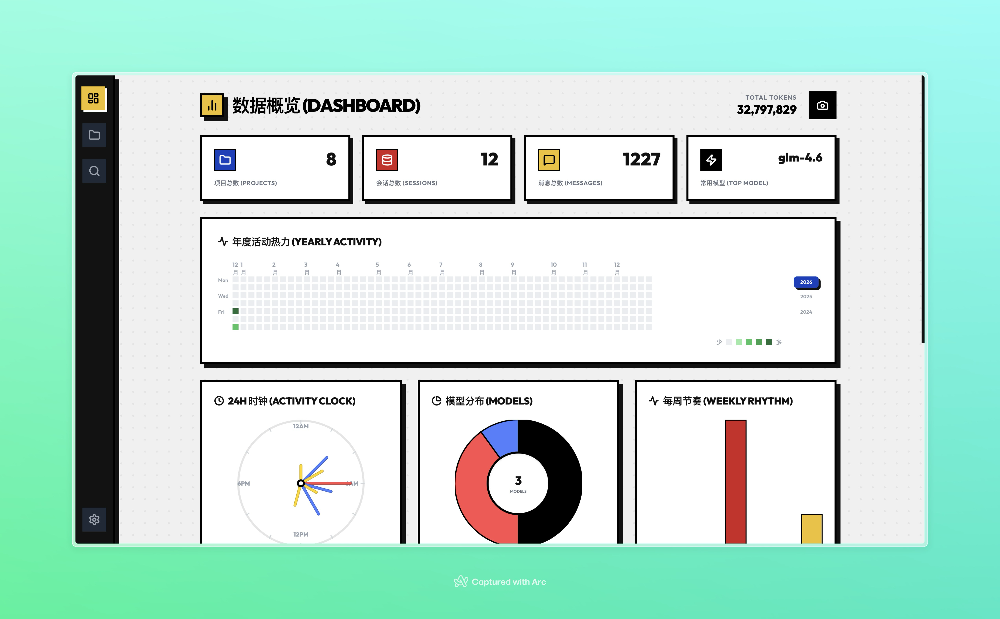
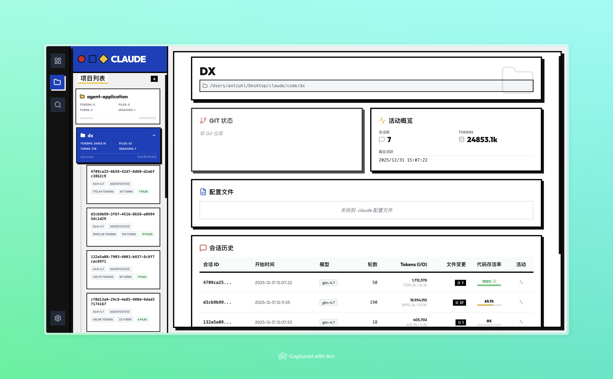
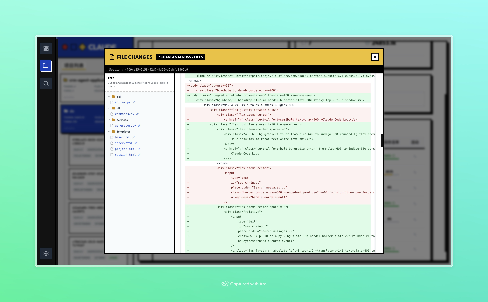
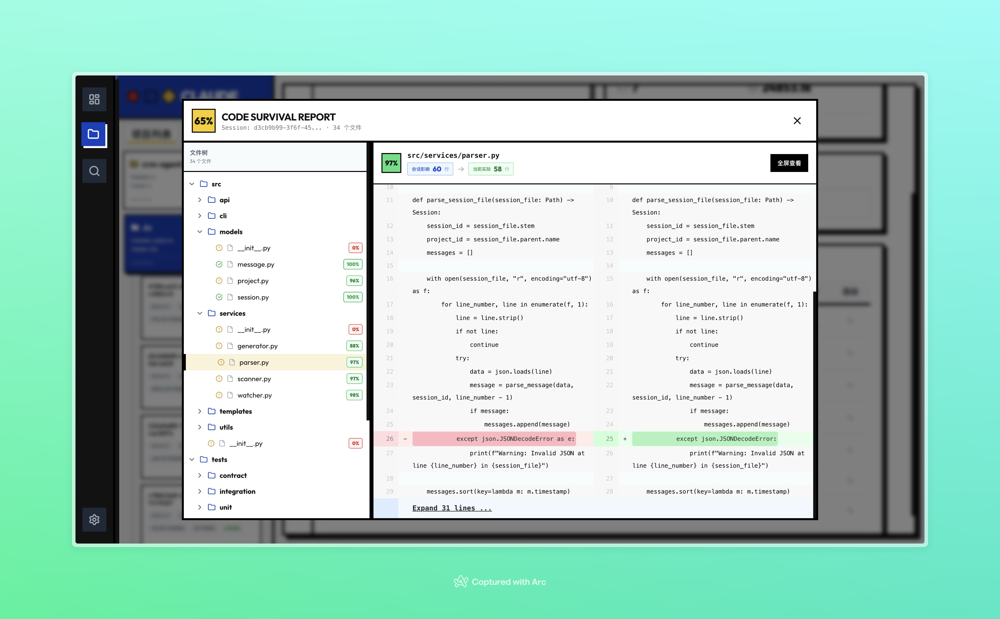
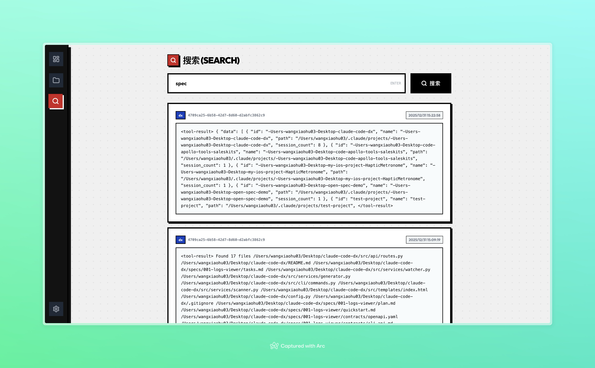
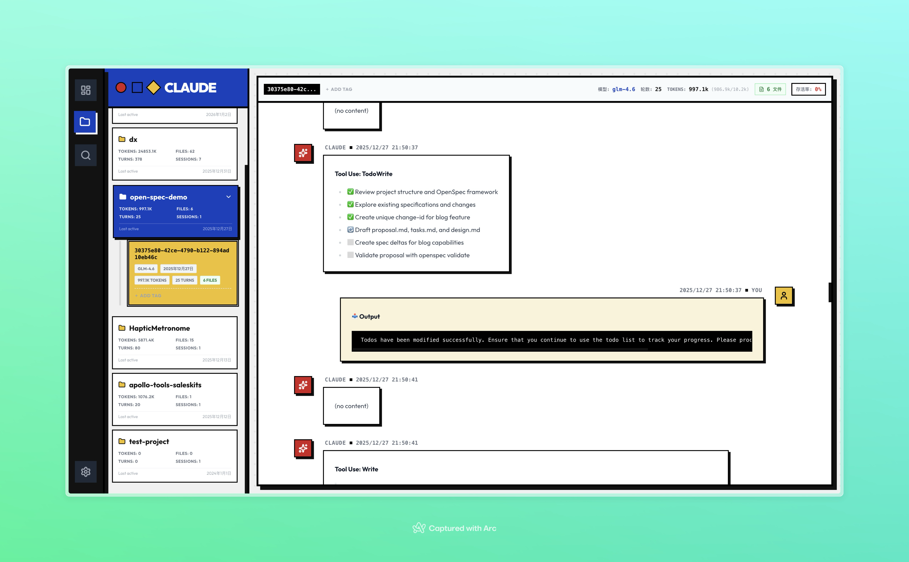
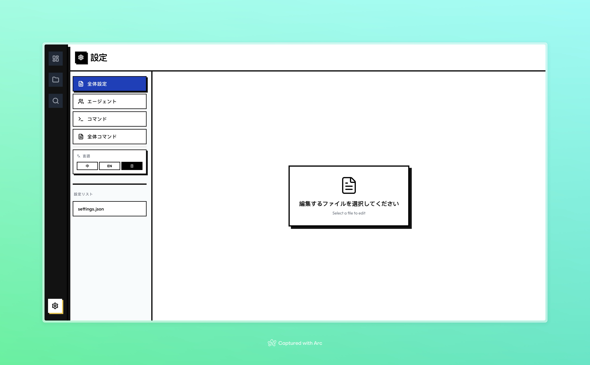

<div align="center">
    
</div>


<div align="center">
    <strong>A Local Visualizer and Analyzer for Claude Code Interaction Logs</strong>
</div>

<br/>

<p align="center">
    <a href="./README.md">简体中文</a> | <a href="./README_EN.md">English</a> | <a href="./README_JP.md">日本語</a>
</p>

<p align="center">
    <a href="LICENSE"></a>
    <a href="https://github.com/CasterWx/claude-code-viewer/stargazers"></a>
    <a href="https://github.com/CasterWx/claude-code-viewer/issues"></a>
    
    
</p>

<br/>

## 📖 Introduction

**Claude Code Viewer** is a local tool designed explicitly for developers to help view, analyze, and manage interaction history with Claude Code. Through a modern Web interface, it solves the problem of unintuitive raw log files and difficult retrieval, making your AI pair programming process transparent and traceable.

## ✨ Features

| Feature | Description | Preview |
| :--- | :--- | :--- |
| **📊 Data Dashboard** | Macro view of key metrics including Token consumption, session frequency, top models, and activity rhythm. |  |
| **🚀 Project-level Session Details** | Insight into session details at the project level, including Token consumption, model usage, turns, AI code survival rate, and file changes per session. |  |
| **👀 Session File Change Details** | Detailed view of which files were modified in each session to assist in reviewing change history. |  |
| **🧐 Code Survival Analysis** | Analyze the actual survival rate of AI-generated code within the project to evaluate AI contribution. |  |
| **🔍 Full-Text Search** | Quickly locate historical sessions based on keywords with fuzzy search support, ensuring no inspiration is lost. |  |
| **📂 Session History Parsing & Restoration** | High-fidelity rendering and restoration of each session detail, providing a superior experience compared to raw log viewing. |  |
| **🌍 Multi-language Support** | Built-in Chinese, English, and Japanese interfaces, switchable with one click. |  |

## 🛠️ Tech Stack

*   **Backend**: Python 3.8+, FastAPI, Uvicorn
*   **Frontend**: React 19, TypeScript, Vite, Tailwind CSS
*   **Visualization**: Recharts, Lucide React

## 🚀 Getting Started

We provide multiple installation methods, with the All-in-One package being recommended.

### Method 1: Source Installation (Recommended)

```bash
# 1. Clone repository
git clone https://github.com/CasterWx/claude-code-viewer.git
cd claude-code-viewer

# 2. Build and Install (Automatically handles frontend build and Python package installation)
python install_package.py

# 3. Start Service
claude-viewer serve
```

After starting, access `http://127.0.0.1:8000` to use the full functionality.

### Method 2: Wheel Package Installation

```bash
# 1. Download the wheel package
https://github.com/CasterWx/claude-code-viewer/releases/tag/v0.1.0

# 2. Install the package
pip install claude_viewer-0.1.0-py3-none-any.whl

# 3. Start Service
claude-viewer serve
```

After starting, access `http://127.0.0.1:8000` to use the full functionality.

## 🤝 Contributing

We welcome Issues and Pull Requests! If you have new ideas or find bugs, please let us know.

1.  Fork this repository
2.  Create your feature branch (`git checkout -b feature/AmazingFeature`)
3.  Commit your changes (`git commit -m 'Add some AmazingFeature'`)
4.  Push to the branch (`git push origin feature/AmazingFeature`)
5.  Open a Pull Request

## 📄 License

This project is open-sourced under the [MIT License](LICENSE).

---

<p align="center">
  Made with ❤️ by <a href="https://github.com/CasterWx">CasterWx</a>
</p>